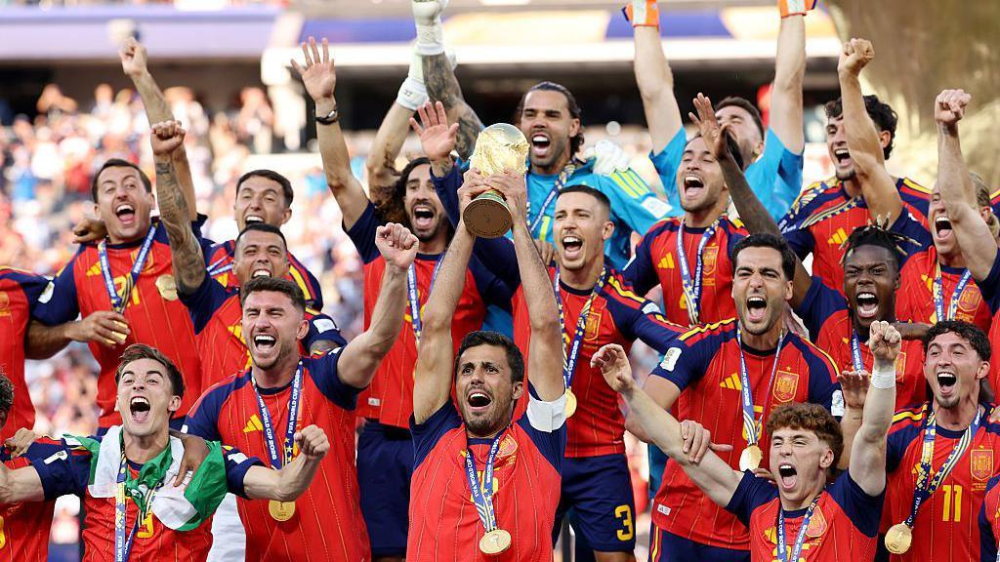

# Data Scientist
## About me
My fascination with data, insights and improving processes was sparked back in 2018 during my time as an analyst in advertising sales.

I saw the power that data held to enhance day-to-day operations for the team, connect with customers and create robust sales strategies, ultimately increasing revenue.

Several years later, I'm working as a data scientist in the financial industry, turning complex machine learning models into simple success stories.

Outside of work, here's what I've been looking at...

## Welcome to my data playground

### [Who will win the FIFA World Cup 2026?](https://github.com/alex-wilson3/aw_ds/tree/main/world_cup_predictor)

Explore predictions for the FIFA World Cup 2026 using CatBoostRanker
